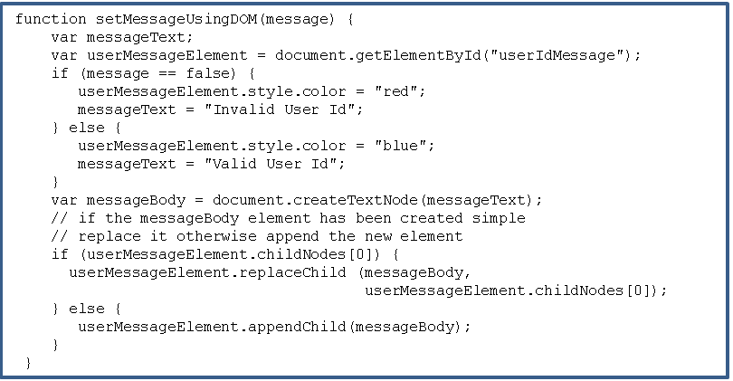

# Ejemplo XmlHttpRequest

El ejemplo muestra como una página html hace mediante javascript una petición XMLHttpRequest para comprobar si existe o no un usuario en el servidor. El usuario se consulta en un API mediante punto de entrada. Por ejemplo: http://localhost:3000/users?name=Pedro para comprobar si en el servidor existe el usuario Pedro. En el caso de que exista se muestra un mensaje "Valid User Id" y en caso de que no exista se muestra "Invalid User Id".

La petición al API se envía mediante XmlHttpRequest de forma asincrona y cuando se recibe la respuesta se refresca solo el mensaje en la página, no la página completa.

    

# pagina.html

    

  
onClick del botón Validar utiliza la función "validateUserId()" que hace una llamada asincrona al servidor. Tiene además un "return false" para que al hacer click no se refresque la página html completa, solo se refresca el mensaje con la función "setMessageUsingDOM(message)".

# ejemploXHR.js

Este fichero contiene las funciones que crean y hacen uso de un objeto XmlHttpRequest para solicitar datos del servidor. Para ello:

1) Define una variable global.

    

2) Funciones validateUserID() y ajaxFunction(). Crean el objeto de tipo XmlHttpRequest, lo configuran y hacen la petición al servidor.

    

3) Función processRequest(). Esta función se ejecuta cada vez que el objeto XMLHttpRequest cambia de estado. Cuando alcanza el estado 4, la petición ha sido respondida desde el servidor.

    

4) Función setMessageUsingDOM(message). Muestra un mensaje en la pantalla dependiendo del valor de "message". True el usuario existe, false no existe.

    

 
  
# db.json
  
Este componente contiene los usuarios que existen en el servidor. El servidor se ha suplantado(mockeado) con json-server. Para instalarlo ejecutar el comando "npm install -g json-server". Para arrancar el servidor ejecutar el comando "json-server --watch db.json". Si todo ha ido bien ya se puede abrir en el navegador "http://localhost:3000/users" y se verán los usuarios existentes.

    

  
# Todo listo
LLegados aquí se puede abrir pagina.html en el navegador y probar la funcionalidad.   
