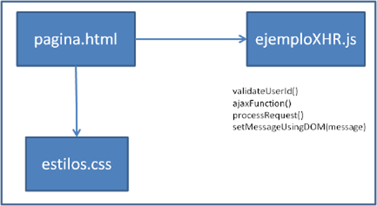

# XmlHttpRequest
Ejemplo de uso de XmlHttpRequest para petición AJAX desde javascript

El ejemplo muestra como desde una página html se hace mediante javascript una petición XMLHttpRequest para comprobar si existe o no un usuario. El usuario se consulta en un API mediante punto de entrada. Por ejemplo: http://localhost:3000/users?name=Pedro para comprobar si en el servidor existe el usuario Pedro. En el caso de que exista se muestra un mensaje "Valid User Id" y en caso de que no exista se muestra "Invalid User Id".
La petición al API se envía mediante XmlHttpRequest de forma asincrona y cuando se recibe la respuesta se refresca solo el mensaje en la página, no la página completa.

    

# pagina.html

    

  
En onClick del botón Validar utiliza la función validateUserId() que es la que hace una llamada asincrona al servidor. Tiene además un "return false" para que al hacer click no se refresque la página html completa.

# ejemploXHR.js
var ajaxRequest;  // The variable that makes Ajax possible!

function validateUserId() {    
    ajaxFunction();    
    // Here processRequest() is the callback function.
    ajaxRequest.onreadystatechange = processRequest;    
    let target = document.getElementById("userid");
    var url = "http://localhost:3000/users?name=" + escape(target.value);
    ajaxRequest.open("GET", url, true);   
    ajaxRequest.send();    
 }

function ajaxFunction() {
   try {
      // Opera 8.0+, Firefox, Safari
      ajaxRequest = new XMLHttpRequest();
   } catch (e) {   
      // Internet Explorer Browsers
      try {
         ajaxRequest = new ActiveXObject("Msxml2.XMLHTTP");
      } catch (e) {      
         try {
            ajaxRequest = new ActiveXObject("Microsoft.XMLHTTP");
         } catch (e) {      
            // Something went wrong
            alert("Your browser broke!");
            return false;
         }
      }
   }
}

function processRequest() {    
    if (ajaxRequest.readyState == 4) {          
       if (ajaxRequest.status == 200) {
         var objeto = JSON.parse(ajaxRequest.responseText);          
         if (objeto[0]==undefined){
           message = false;
         } else {
            message=true;
         }
          setMessageUsingDOM(message);
       }
    }
    return; 
}

function setMessageUsingDOM(message) {
    var messageText;
    var userMessageElement = document.getElementById("userIdMessage");    
    if (message == false) {
       userMessageElement.style.color = "red";
       messageText = "Invalid User Id";
    } else {
       userMessageElement.style.color = "blue";
       messageText = "Valid User Id";
    }    
    var messageBody = document.createTextNode(messageText);        
    // if the messageBody element has been created simple 
    // replace it otherwise append the new element    
    if (userMessageElement.childNodes[0]) {
       userMessageElement.replaceChild(messageBody, userMessageElement.childNodes[0]);       
    } else {        
       userMessageElement.appendChild(messageBody);       
    }
 }
 
 Incluye las funciones:
 
 - validateUserId(). Es la función llamada desde el onClick de pagina.html. Desencadena la creación de un objeto XmlHttpRequest. Lo configura y envía la petición al servidor.
 - ajaxFunction(). Crea el objeto XmlHttpRequest.
 - processRequest(). Se ejecuta cada vez que el objeto XmlHttpRequest cambia de estado. Cuando el objeto está en estado 4 la petición al servidor ha sido respondida y esta función comprueba si el usuario solicitado existe o no en el servidor.
 - setMessageUsingDOM(message). Dependiendo de la respuesta de la función processRequest() sobre si el usuario existe o no, está función actualiza el mensaje para mostrar en la página el mensaje que corresponda.
 
#db.json
{
    "users": [
      {
        "name": "Pedro",
        "id": 1
      },
      {
        "name": "Ana",
        "id": 2
      },
      {
        "name": "Luis",
        "id": 3
      },
      {
        "name": "Rosa",
        "id": 4
      },
      {
        "name": "Antonio",
        "id": 5
      },
      {
        "name": "Fernando",
        "id": 6
      },
      {
        "name": "Eloy",
        "id": 7
      },
      {
        "name": "Francisco",
        "id": 8
      },
      {
        "name": "Benjamin",
        "id": 9
      },
      {
        "name": "Susana",
        "id": 10
      }
    ]
  }
  
  Este componente contiene los usuarios que existen en el servidor. El servidor se la suplantado (mockeado) con json-server. Para instalarlo ejecutar el comando "npm install -g json-server". Para arrancar el servidor ejecutar el comando "json-server --watch db.json". Si todo ha ido bien ya se puede abrir en el browser "http://localhost:3000/users" y verás los usuarios existentes.
  
LLegados aquí se puede abrir pagina.html en un browser y probar la funcionalidad.  
 
 
